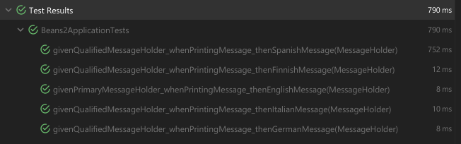
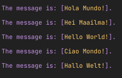
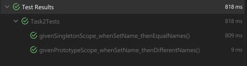
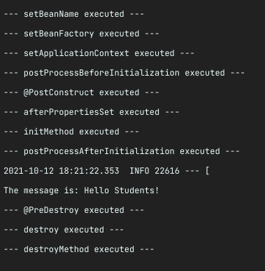

# Spring Beans Pt. 1

In this exercise, you'll be doing a series of different tasks. Pay attention to each and try to
achieve the final result.

In this exercise, you'll be required to create your own Spring Boot Application **for each task!**

The simplest you to do that is to head to https://start.spring.io/. No extra dependencies are needed
to any task.

Before **each task**, create a Spring Boot application and work your way on it. Download the zip
file (if done with Spring Initializr), open it with your IDE and load the maven/gradle file. Then
everything should be good to go.

##

## Task 1 - Getting beans from the ApplicationContext

Create a package called `task1`. This task will be done inside this package.

For this task, you'll be playing with the `ApplicationContext`. Create a class inside a package
called `mybean`. You can give it any name.

Make it visible to Spring! annotate it with the `@Component` annotation.

Now, make your bean be aware of the ApplicationContext! Make it implement the
`ApplicationContextAware` interface.

This interface requires you to implement a single method:

```java
void setApplicationContext(ApplicationContext applicationContext)throws BeansException;
```

So create a field in your class of type `ApplicationContext` and set its value using this method. Go
ahead and also create a `get` method for the `ApplicationContext`! So we can use it using our bean.

Now, create **three** different classes. They can also be located in the `mybean` package, or you
can just create them in another package. You can just call them `Bean1`, `Bean2` and `Bean3`, or
whichever name you prefer.

Annotate each one of them with the `@Component` annotation, so they will be registered as beans in
our application context.

Now, head to the **test class** of your application. You'll find it inside the
**test/java/** folder.

Initially, your test class should look like this:



Note that it uses the `@SpringBootTest` annotation, which runs the application in a test context.
That means the IoC container (the application context) is created and the beans initialized, the
same way as it does when running the application. The advantage here is that we can **inject** beans
to this class the same way we do in a normal context.

You are to create a couple tests. Remember to always mark your tests with the `@Test` annotation.

###

### Test 1: `void appContextNotNull()`

This is a very simple test. You are to **inject** your `ApplicationContextAware` bean here to the
test class. You can achieve that with the `@Autowired`, injecting directly to the field.

Once it's wired, the test should do a simple assert: make sure the injected bean **is not null**.

> **Hint:** You should use the `Assertions.assertNotNull(myBean)` here.

###

### Test 2: `void appContext_getByName(Bean1 bean1)`

In this test, you should try to get the bean by name from the application context, and assert that
the expected result is the same as the one that is wired to other components.

See how the test method **receives an instance of Bean1**? You should wire the bean to the method,
using the `@Autowired` annotation.

Once it's wired get the application context from your `ApplicationContextAware` bean using the
`get` method you put in it. Now, make sure the bean you get from the application context **is the
same as the one you're injecting in this test method**. For this test, you should get the bean from
the application context **by its name**.

> **Hint:** If not given a name, the bean created with the `@Component` annotation will have the
> class' name, but uncapitalized.
>
> `Bean1` class >> `bean1` bean name.

You should have an assertion similar to the following:

```java
Assertions.assertEquals(bean1,applicationContext.getBean("bean1"));
```

###

### Test 3: `void appContext_getByType(Bean2 bean2)`

This test should follow the same principle as the one above, but you'll be wiring a bean of type
`Bean2` instead.

Besides that, you should get the `Bean2` from the application context **by its type**:

```java
Assertions.assertEquals(bean2,applicationContext.getBean(Bean2.class));
```

###

### Test 4: `void appContext_getByNameAndType(Bean3 bean3)`

Finally, the last test should follow the same principle as the ones before, but you'll be wiring a
bean of type
`Bean3` here.

You should also get the `Bean3` from the application context **by its name and type**:

```java
Assertions.assertEquals(bean3,applicationContext.getBean("bean3",Bean3.class));
```

If you did everything right, you should be getting the following result:



#

---

##

## Task 2 - Using different scopes

Create a package called `task2`. The code for this task should go here.

In this task, we'll be checking the two main scopes a bean can have: `singleton` and `prototype`.

###

### Task 2.1 - Singleton Scope

In the first part of this task, you should define a bean with the `singleton` scope.

Create a class called `Person` inside a `beans` package. It should have a single field called `name`
, and use only the default constructor. Create also a getter and setter for this field.

Create also a class called `Task2Config` inside a `config` package. The class should be marked with
the `@Configuration` annotation.

Inside this class, define a bean of type `Person`. You do that by creating a method that returns an
instance of `Person`, and by marking the method with the `@Beans` annotation.

Also explicitly mark the bean as a singleton, by using the `@Scope` annotation.

> **Hint**: The scope can be defined in two different ways: Either by writing down the value as a
> `String`, or by using the constant that contains the String value (thus being typing error proof):
> - `@Scope("singleton")`
> - `@Scope(ConfigurableBeanFactory.SCOPE_SINGLETON)`

##

#### Test 2.1 - Testing Singleton Scope

Now it's time to write the test for the singleton scope. Create a new test class called
`Task2Tests`. It should follow the same principle of the previous test class (be annotated
with `@SpringBootTest`).

Autowire the application context by setting a field in the test class of `ApplicationContext` and
annotating it with the `@Autowired` annotation.

Also create two String constants, containing two different names. It can be any name. I.e.:

```java
private static final String NAME_1="Jack James";
private static final String NAME_2="Hill Downhill";
```

Now, create a test to test the singleton bean. The test should:

1. Create **two** variables of type `Person` (i.e. `person1` and `person2`) and assign to them the
   bean captured from the `applicationContext`. To not conflict with the next test, make sure to get
   the bean using both the name and the type;
2. Using the setter, assign the first name (`NAME_1`) to only **one** of the variables, i.e.
   to `person1`;
3. Assert that the actual value of both `person1.getName()` and `person2.getName()` should be the
   value of `NAME_1`;
4. Now, assign the value of `NAME_2` to only **one** of the variables, i.e. to `person2 ;
5. Assert again that both `person1.getName()` and `person2.getName()` should be the value
   of `NAME_2`.

##

### Task 2.2 - Prototype Scope

Now we'll be using the prototype scope. Go to the `Task2Config` file and declare another bean of
type `Person`, the same way you did before, but now declare the scope as `"prototype"`.

> **Hint**: Alternatively, just like before, you can use the constant value instead to declare the
> scope: `@Scope(ConfigurableBeanFactory.SCOPE_PROTOTYPE)`

##

#### Test 2.2 - Testing Prototype Scope

The test should be similar:

1. Create **two** variables of type `Person` (i.e. `person1` and `person2`) and assign to them the
   bean captured from the `applicationContext`. To not conflict with the next test, make sure to get
   the bean using both the name and the type;
2. Using the setter, assign the first name (`NAME_1`) to `person1`;
3. Now, assert that `person1.getName()` should be `NAME_1`, and `person2.getName()` should be `null`
   ;
4. Set the name of `person2` to `NAME_2`;
5. Assert that `person1.getName()` should be `NAME_1` and `person2.getName()` should be `NAME_2`.

If you did everything right, you should be getting the following result:



#

---

##

## Task 3 - Bean Lifecycle

Create a package called `task3`. The code for this task should go here.

In this task, we'll write a Spring bean to see the execution order of each phase of the lifecycle.

#

### Task 3.1 - The Lifecycle Bean

Inside this package, create a new bean class. Create a field called `message` in it and create its
getter and setter.

Implement a couple aware interfaces, like `BeanNameAware`, `ApplicationContextAware`
and `BeanFactoryAware`.

Make it also implement the lifecycle callback interfaces `InitializingBean` and `DisposableBean`.

For each of the methods presented in this bean, you should simply print a message to the console
saying which method is being executed. I.e:

```java
  @Override
public void setBeanName(String name){
    System.out.println("--- setBeanName executed ---");
    }
```

After implementing all the aware and callback interfaces, go ahead and also create two new methods,
using the **JSR-250 annotations**, `@PostConstruct` and `@PreDestroy`. Implement these methods in
the same way as the others.

Now also create the methods that will be defined in the `@Bean` declaration, an `initMethod` and
a `destroyMethod`.

Last but not least, create the `BeanPostProcessor` class to hook into the before and after
initialization phases. Implement the `BeanPostProcessor` interface and manually override
the `postProcessBeforeInitialization` and `postProcessAfterInitialization` methods.

In these implementations, since the `BeanPostProcessor` is not bean specific but application
specific, you need to make sure we're dealing with our bean before printing out a message:

```java
  @Override
public Object postProcessBeforeInitialization(Object bean,String beanName)
    throws BeansException{
    if(bean instanceof MySpringBean){
    System.out.println("--- postProcessBeforeInitialization executed ---");
    }
    return bean;
    }
```

#

### Task 3.2 - The Configuration Class

Once all the hooks of our bean have been defined, we need to create a @Configuration class, where we
should define both our lifecycle bean and our `BeanPostProcessor` bean. Don't forget to declare
the `initMethod` and the `destroyMethod`!

#

### Task 3.3 - The Test Class

Finally, we write a `@SpringBootTest` class to run our Spring context.

In our test class, you should autowire your lifecycle bean.

The class should contain a single test, where you should set the message of your bean using
the `bean.setMessage()`.

After that, assert that the message is equals to the message you just set. Print the message on the
console afterwards.

Watch the console output. You should have a similar output to this one:



Happy Coding!